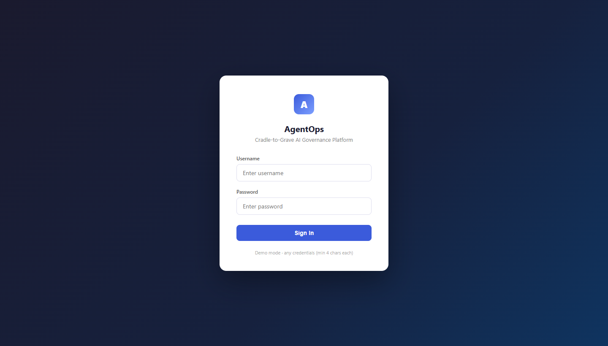
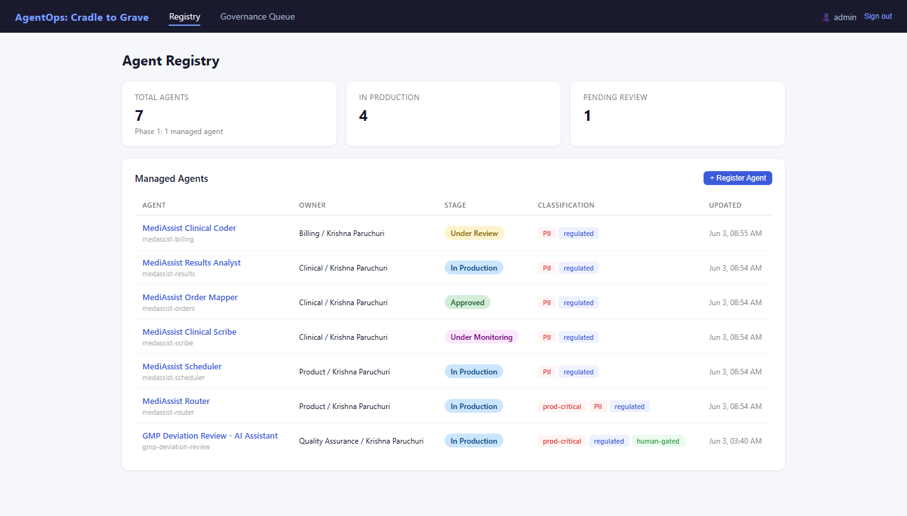
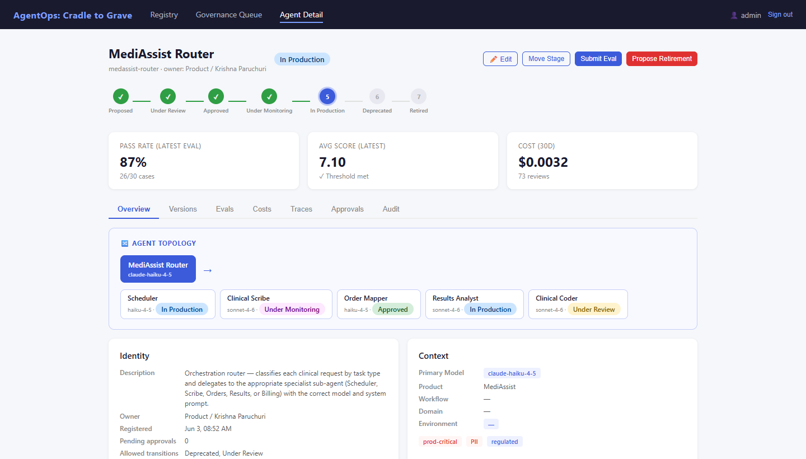
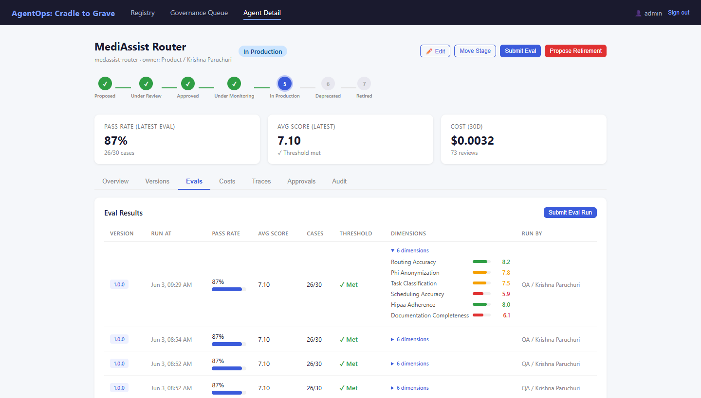
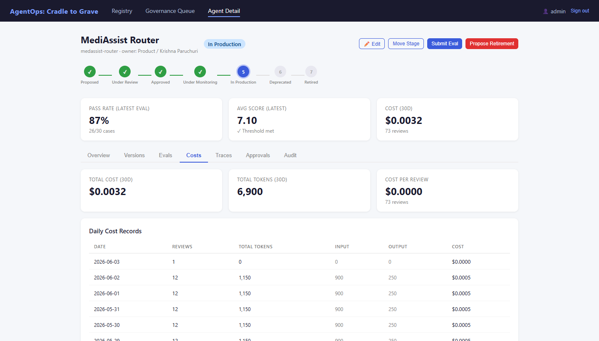
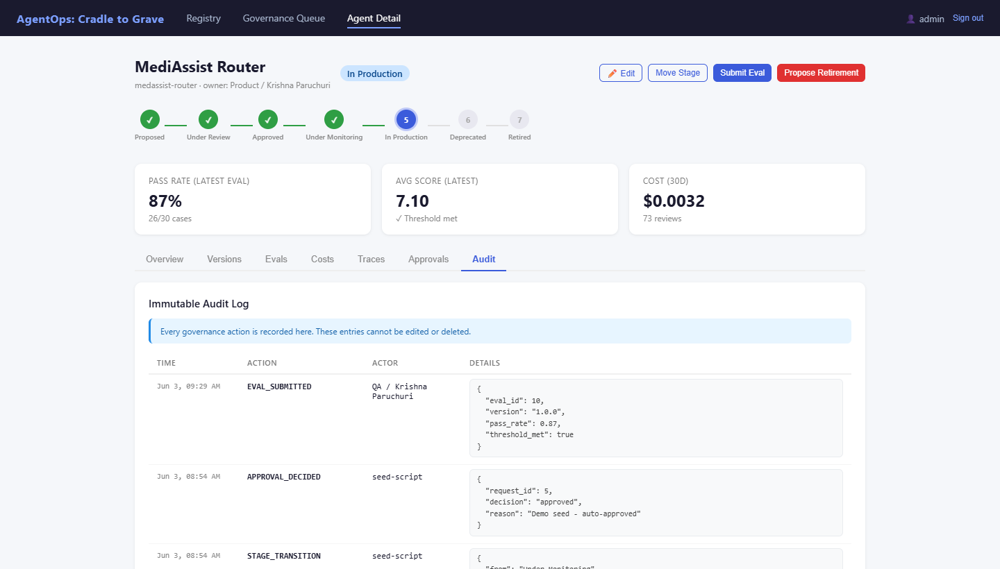
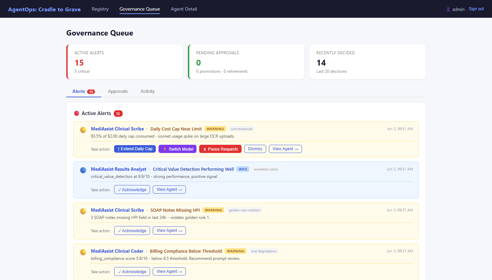
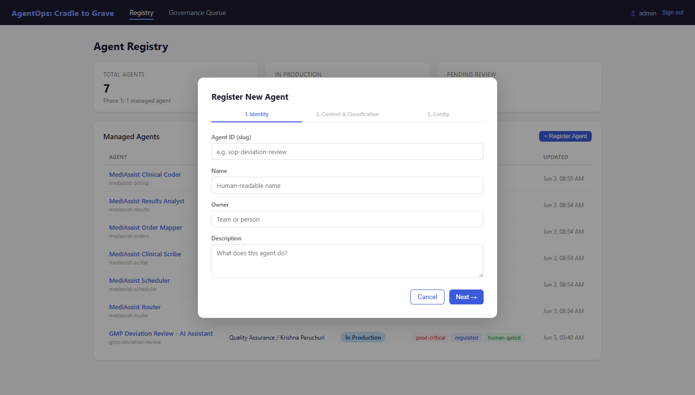

# AgentOps: Cradle to Grave

A **multi-agent governance platform** for managing AI agents across their full lifecycle — from registration through production monitoring and retirement — with maker-checker approvals, eval-gated promotion, cost tracking, LangSmith observability, and an immutable audit trail.

Built as a learning-by-doing exercise in regulated-domain AI governance. The goal is not another agent — it's the governance layer *above* agents: lifecycle control, approval workflows, eval thresholds, cost dashboards, and topology visualisation for orchestrated agent systems.

🔗 **Live demo:** [agentops.krishna1parchuri.workers.dev](https://agentops.krishna1parchuri.workers.dev)

---

## Screenshots

### Login Screen


### Agent Registry — all managed agents with stage badges


### Agent Detail — Overview with MediAssist Topology Card


### Agent Detail — Eval dimensions with per-dimension score bars


### Agent Detail — Cost & token usage charts


### Agent Detail — Immutable audit log


### Governance Queue — Approval workflow & active alerts


### Register New Agent — 3-step form (Identity → Context & Classification → Config)


---

## What It Does

| Capability | Status |
|---|---|
| Agent Registry (multi-agent) | ✅ |
| Lifecycle state machine (7 stages) | ✅ |
| Maker-checker approval workflow | ✅ |
| Eval-gated promotion | ✅ |
| Cost & token tracking (per-agent, daily) | ✅ |
| LangSmith trace observability (APAC) | ✅ |
| Agent Topology Card (orchestration view) | ✅ |
| Parent / sub-agent badge navigation | ✅ |
| Eval dimensions with score bars | ✅ |
| Active alerts & governance queue | ✅ |
| Immutable audit log | ✅ |
| Login screen (demo auth, 4-char min) | ✅ |
| Retirement workflow | ✅ |

---

## Managed Agents

Two production AI systems are currently governed by this platform:

### 1 — SOP Deviation Review (GMP Compliance)

Single-agent pharmaceutical QA assistant. Analysts paste a free-text deviation scenario and receive a structured assessment — severity classification, QA escalation decision, impact statement, immediate action steps, and a draft CAPA summary — in under 10 seconds.

| Field | Value |
|---|---|
| Agent ID | `sop-deviation-review` |
| Model | `claude-haiku-4-5` |
| Stage | In Production |
| Live app | [pharmacomplianceai.krishna1parchuri.workers.dev](https://pharmacomplianceai.krishna1parchuri.workers.dev) |

### 2 — MediAssist AI (Clinical Workflow)

Multi-agent clinical workflow system. A **Router + 5 Specialists** architecture: the router classifies each clinical request by `task_type` and delegates to the appropriate specialist with the correct model and enforced system prompt.

| Agent | Role | Model | Stage |
|---|---|---|---|
| `medassist-router` | Orchestration router — classifies & routes | claude-haiku-4-5 | In Production |
| `medassist-scheduler` | Appointment scheduling & registration | claude-haiku-4-5 | In Production |
| `medassist-scribe` | Clinical SOAP note generation | claude-sonnet-4-6 | Under Monitoring |
| `medassist-orders` | Diagnostic order mapping (LOINC codes) | claude-haiku-4-5 | Approved |
| `medassist-results` | Lab & imaging result analysis | claude-sonnet-4-6 | In Production |
| `medassist-billing` | ICD-10/CPT medical coding | claude-sonnet-4-6 | Under Review |

The router's **Topology Card** in the AgentOps dashboard visualises the full orchestration tree with live stage badges and clickable navigation between agents.

---

## Lifecycle State Machine

```
Proposed → Under Review → Approved → Under Monitoring → In Production → Deprecated → Retired
```

Every transition is validated against an explicit rule table. Key gates:

- **Under Review → Approved** — requires a passing eval result (score ≥ threshold) before an approval request can even be submitted
- **Approved → Under Monitoring / In Production** — require a separate maker and checker (proposer ≠ reviewer)
- Every transition writes an immutable row to the audit log — no update or delete endpoint exists

---

## MediAssist Router Logic

```
task_type        → specialist agent       model
──────────────────────────────────────────────────────
"registration"   → medassist-scheduler    claude-haiku-4-5
"scheduling"     → medassist-scheduler    claude-haiku-4-5
"scribe"         → medassist-scribe       claude-sonnet-4-6
"orders"         → medassist-orders       claude-haiku-4-5
"results"        → medassist-results      claude-sonnet-4-6
"billing"        → medassist-billing      claude-sonnet-4-6
(absent)         → pass-through           body.model
```

Each specialist has an enforced system prompt with clinical guardrails:

- **Scribe** — always include `chief_complaint`, `HPI`, `assessment`, `plan`; never provide a definitive diagnosis
- **Results** — always flag critical values with `status=CRITICAL`; always include `follow_up_suggestions` for abnormals
- **Billing** — always run denial risk analysis; only output ICD-10/CPT codes substantiated by documented clinical findings
- **Orders** — every order must map to a LOINC code; priority always explicit (`high`/`medium`/`low`)

---

## Architecture

```
Browser (React 18, single-file SPA — no build step)
    │  REST API
    ▼
FastAPI backend  (Railway — https://agentops-production-980c.up.railway.app)
    ├── GET/POST  /agents                       registry CRUD
    ├── POST      /agents/{id}/transitions      lifecycle state machine
    ├── POST      /agents/{id}/approvals        maker-checker approval requests
    ├── POST      /agents/{id}/approvals/{r}/decision  approve / reject
    ├── POST      /agents/{id}/evals            eval result submission
    ├── GET/POST  /agents/{id}/costs            daily token + USD cost records
    ├── GET/POST  /agents/{id}/traces           trace records
    ├── GET/POST  /agents/{id}/alerts           governance alerts
    └── GET       /agents/{id}/audit            immutable audit log
    │
    ▼
SQLite (WAL mode)
    ├── agents              — registry + classification JSON
    ├── agent_versions      — version history
    ├── lifecycle_transitions
    ├── approval_requests
    ├── eval_results        — with per-dimension scores (JSON field)
    ├── cost_records        — daily token + USD cost per agent
    ├── traces              — linked to LangSmith run IDs
    ├── alerts              — governance events
    └── audit_log           — append-only, no delete endpoint
```

**Live observability flow (MediAssist):**

```
User action in MediAssist UI
    │
    ▼
Cloudflare Worker  (worker.js)
    ├── Routes task_type → specialist config (agent_id + model + system_prompt)
    ├── Validates model against whitelist
    ├── Calls Anthropic API
    └── ctx.waitUntil()  — background, non-blocking:
        ├── pushLangSmith()   → LangSmith APAC  (anonymised trace)
        └── pushAgentOpsCost() → AgentOps backend (cost record per agent)
```

---

## Stack

| Layer | Technology |
|---|---|
| Backend | FastAPI + SQLite (WAL), deployed on Railway |
| Frontend | Single-file React 18 SPA (no build), Cloudflare Workers |
| MediAssist proxy | Cloudflare Worker (`worker.js`) |
| Observability | LangSmith (APAC region endpoint) |
| GMP backend | FastAPI + SQLite, Railway |

---

## Quickstart (Local)

```bash
# 1. Backend
cd backend
pip install -r requirements.txt
python seed.py          # seeds SOP Deviation Review with eval/cost data
uvicorn main:app --reload --port 8000

# 2. Seed MediAssist (run from the project root — needs backend running)
python seed_medassist.py

# 3. Frontend — open directly in browser (no build step)
open frontend/index.html
```

API docs: `http://localhost:8000/docs`

---

## Key Design Decisions

See [`DECISIONS.md`](DECISIONS.md) for full rationale. Summary:

- **Explicit transition table** — every valid `(from, to)` pair with its gate requirements in one place; no conditional spaghetti
- **Maker-checker** transplanted from financial transaction safety — proposer and reviewer must be different people
- **Eval gate enforced at API level** — the state machine rejects the transition even with an approved request if no passing eval is attached
- **INSERT-only audit log** — no `UPDATE` or `DELETE` endpoint exists anywhere in the codebase
- **`classification` JSON field** — carries `sub_agents[]`, `parent_agent_id`, golden rules, guardrails, and budget config without schema changes; this single field drives the Topology Card
- **PHI anonymisation before trace push** — regex strips phone numbers, dates, MRNs, and names before any text reaches LangSmith or AgentOps
- **Model selection by task complexity** — haiku for scheduling / routing / orders (fast, cheap); sonnet for scribe / results / billing (clinical reasoning required)

---

## Security

- All API keys are environment variables only — never in frontend JS or committed to git
- MediAssist frontend calls `/api/claude` (relative path); the Cloudflare Worker holds `ANTHROPIC_API_KEY` server-side
- PHI anonymisation runs before every observability push
- Login screen gates both frontends (demo mode: any credentials ≥ 4 chars, session-scoped)
- AgentOps backend URL is set via `window.AGENTOPS_API` in `config.js` — not hardcoded

---

## Deployment

| Service | Platform | URL |
|---|---|---|
| AgentOps backend | Railway | `https://agentops-production-980c.up.railway.app` |
| AgentOps dashboard | Cloudflare Workers | `https://agentops.krishna1parchuri.workers.dev` |
| MediAssist AI | Cloudflare Workers | `https://medassist-ai.krishna1parchuri.workers.dev` |
| GMP Deviation Review | Cloudflare Workers | `https://pharmacomplianceai.krishna1parchuri.workers.dev` |

```bash
# Deploy AgentOps frontend
cd frontend && npx wrangler deploy

# Deploy MediAssist
cd "MedAssist AI" && npm run build && npx wrangler deploy
```

---

## Folder Structure

```
agentops/
├── backend/
│   ├── main.py              # FastAPI app — all endpoints, AgentOps sync endpoint
│   ├── database.py          # SQLite schema + WAL-mode connection helpers
│   ├── lifecycle.py         # Explicit (from, to) transition table + gate logic
│   ├── agentops_push.py     # Cost/trace sync helper
│   ├── seed.py              # Seeds SOP Deviation Review agent with demo data
│   └── requirements.txt
├── frontend/
│   ├── index.html           # Full React SPA — Registry, Detail, Governance Queue
│   ├── config.js            # Runtime config: window.AGENTOPS_API backend URL
│   └── wrangler.toml        # Cloudflare Workers deploy config
├── docs/
│   └── screenshots/         # README screenshots (captured from live demo)
├── DECISIONS.md             # Product decision log (D-01 onward)
└── README.md
```

*(The `seed_medassist.py` script lives one level up in the Projects root and seeds all 6 MediAssist agents.)*

---

*Built by Krishna Paruchuri. Product decisions are mine; implementation is AI-assisted. That's modern senior PM work.*
